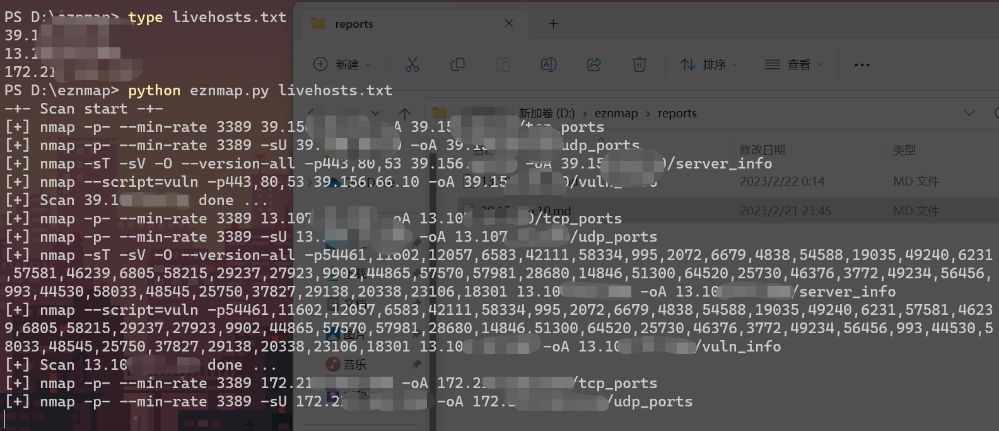
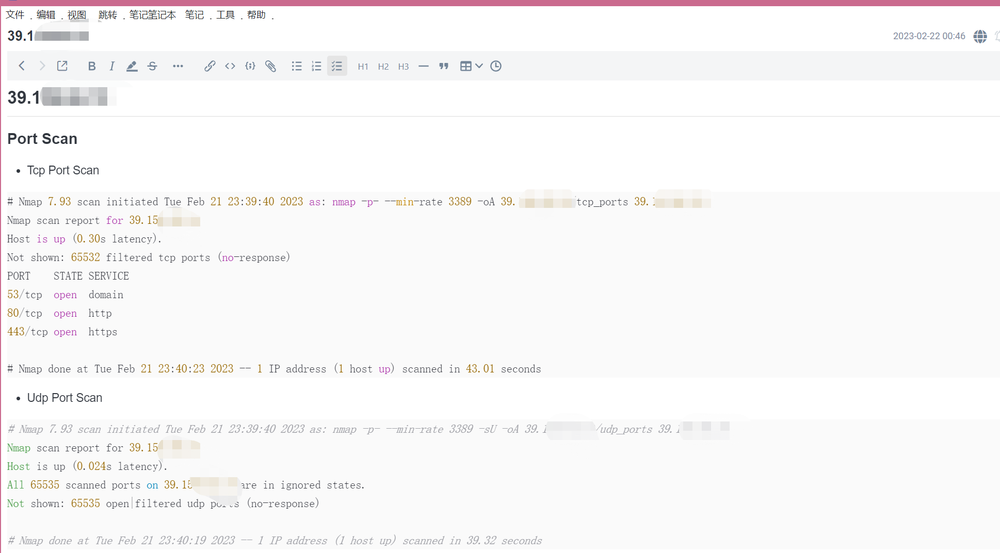
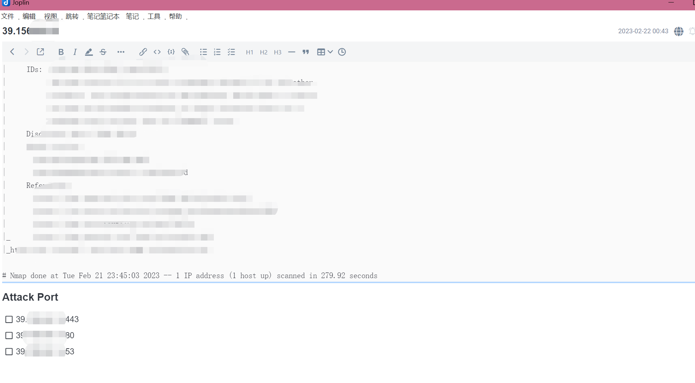
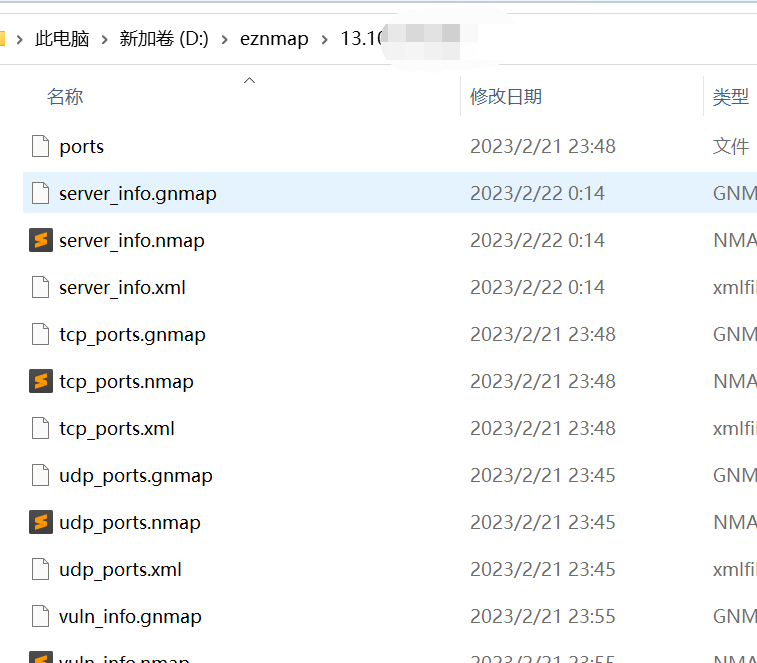

# eznmap - 自动化 nmap 扫描
nmap's py tool

## 简介

看了红队笔记的视频，用其思路写了个自动 nmap 扫描脚本。

正在扫描的图片:



输出的 markdown 文件: 





生成的其他文件:


 
## 使用方法

> eznmap.py 文件第 7 行可以修改脚本运行速度。

1. 已项目名称创建文件夹并进入
2. 首先通过 nmap 进行存活探测
3. 将探测存活的主机 IP 列表提取到文件中
4. 使用eznmap.py

```
mkdir Project_Name && cd Project_Name
nmap -sn 192.168.1.1/24 --min-rate=300 -oG LiveHosts.gnmap
cat LiveHosts.gnmap | grep Up | awk '{print $2}' >> LiveHosts.txt
python3 eznmap.py LiveHosts.txt
```

### 注意

- 如果项目目录中，已有 IP 地址作为文件名，那么这些 IP 地址将会被跳过扫描
- 针对 IP 的扫描结果全部输出到文件，目录名以 IP 命名. Example: 192.168.1.1/tcp_ports.gnmap;192.168.1.1/server_info.nmap
- 导出的 Markdown 文档输出到 reports 文件夹中，同样以 IP 命名. Example: reports/192.168.1.1.md


## 主要流程：
 
 1. 扫描 TCP UDP 全端口端口，
 2. 针对扫描得到的端口进行**服务探测**和**系统版本探测**
 3. 针对扫描得到的端口进行 nmap 默认脚本的**漏洞探测**
 4. 整理几次扫描结果到 Markdown 文档中
 
需要注意的是: tcp 和 udp 的全端口扫描是同步进行的。所以速度不要调整太快

## 其他问题

> 问: 你个垃圾，你用 Python 写，是不是不会 Shell 脚本？
> 答: Win (我是废物)
> 问: Shell 处理字符串，不比正则好使？
> 答: Win (这是真的)

